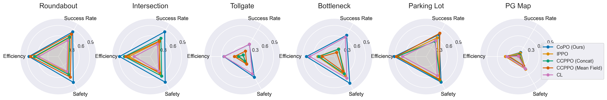

# MetaDrive Multi-agent Environment Benchmark Results

* MetaDrive version: [0.2.5](https://github.com/metadriverse/metadrive/tree/releases/0.2.5)
* Training code: [CoPO repo](https://github.com/decisionforce/CoPO)
* Related project: [CoPO webpage](https://decisionforce.github.io/CoPO/)

**To DO:**

- [ ] Update best checkpoints in CoPO repo
- [ ] Deliver this page to other researchers that are looking for this
- [ ] Update training performance when train with 5M steps

## Training Results

Learning curve:

Success rate table:

|                    | Bottleneck    | Tollgate      | Intersection   | Roundabout   | Parking Lot   | PG Map        |
|:-------------------|:--------------|:--------------|:---------------|:-------------|:--------------|:--------------|
| IPPO               | 24.04 (18.74) | 4.41 (2.56)   | 71.91 (5.27)   | 66.43 (4.99) | 16.98 (5.90)  | 81.81 (6.50)  |
| CCPPO (Mean Field) | 14.60 (11.24) | 14.86 (16.47) | 70.79 (6.29)   | 71.03 (5.45) | 20.66 (3.47)  | 79.56 (3.92)  |
| CCPPO (Concat)     | 19.55 (15.80) | 3.53 (1.92)   | 75.67 (3.18)   | 67.82 (4.09) | 12.01 (7.52)  | 80.21 (3.58)  |
| CL                 | 78.80 (3.79)  | 37.90 (29.93) | 81.57 (2.95)   | 82.34 (3.35) | 31.16 (14.36) | 77.82 (24.85) |
| CoPO               | 47.39 (19.49) | 27.19 (25.63) | 79.47 (4.97)   | 72.82 (6.73) | 19.51 (5.59)  | 83.40 (3.13)  |

## Radar Figure

The evaluation results when we run IPPO, CCPPO and CoPO for 1M environment steps:

The evaluation results when we run IPPO, CCPPO and CoPO for 5M environment steps:

> **Note**
> Curriculum Learning evaluationg results are not included since we only save the top 5 checkpoints according to the *training success rate*. However, this leads to poor evaluate results since the best training success rate happens in the begining of CL training but the checkpoints at that time have poor generalizability in the "full" environment. You should probabily run `train_all_cl.py` with the argument `keep_checkpoints_num` set to None.

## Training, Evaluation and Plotting Scripts

We run 5 algorithms in 6 multi-agent environments. Each experiment is repeated 8 times. The training scripts are provided in:  https://github.com/decisionforce/CoPO/tree/main/copo_code/copo

Evaluation script is provided in:  https://github.com/decisionforce/CoPO/blob/main/copo_code/copo/eval.py

Please refer to [CoPO repo](https://decisionforce.github.io/CoPO/) for more information in training and evaluation.

To draw learning curves and get the performance table, please refer to `Process and draw training results.ipynb` notebook.
If you want to parse the data generated by your own experiments, please refer to `Preprocess training data.ipynb` notebook.

To draw evaluation resutls, please refer to `Process and plot evaluate results (1M steps).ipynb` and
`Process and plot evaluate results (5M steps).ipynb` notebooks.

## Data

The compressed evaluation results that you can use to draw figure are provided in: [train1m_evaluate_results.csv](train1m_evaluate_results.csv) and [train5m_evaluate_results.csv](train5m_evaluate_results.csv)

You can download the raw evaluation results here:  https://github.com/metadriverse/metadrive-benchmark/releases/tag/asset-marl

The compressed training log that you can use to draw learning curves are provided here: 
https://github.com/metadriverse/metadrive-benchmark/releases/download/asset-marl/training_curves.zip

Due to the huge volumn of the training results, we can not provide the raw training results and intermediate checkpoints.

(WIP) We select the best checkpoints and upload them to:  XXXX  You can also find them in the CoPO repo where you can XXXX them with XXXX.

## Reference

Please cite MetaDrive paper via: https://github.com/metadriverse/metadrive#-references

Please cite CoPO paper via: https://github.com/decisionforce/CoPO#citation
