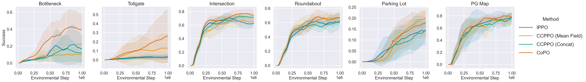
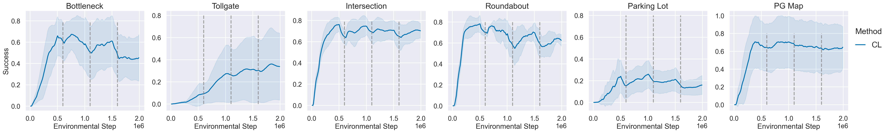

# MetaDrive Multi-agent Environment Benchmark Results

* MetaDrive version: [0.2.5](https://github.com/metadriverse/metadrive/tree/releases/0.2.5)
* Training code: [CoPO repo](https://github.com/decisionforce/CoPO)
* Related project: [CoPO webpage](https://decisionforce.github.io/CoPO/)

### Results

Learning curve:

Success rate table:

|              | Bottleneck    | Tollgate      | Intersection   | Roundabout   | Parking Lot   | PG Map       |
|:-------------|:--------------|:--------------|:---------------|:-------------|:--------------|:-------------|
| IPPO         | 74.18 (15.87) | 74.72 (15.82) | 73.93 (9.18)   | 64.55 (5.17) | 20.90 (5.70)  | 83.82 (4.40) |
| MF-CCPPO     | 65.27 (17.06) | 48.62 (32.84) | 71.58 (7.79)   | 68.95 (4.78) | 14.42 (4.92)  | 79.63 (4.71) |
| Concat-CCPPO | 51.93 (17.03) | 31.92 (26.01) | 62.67 (12.46)  | 64.50 (8.46) | 4.73 (3.83)   | 75.38 (8.69) |
| CL           | 66.45 (10.50) | 52.99 (22.86) | 67.90 (15.00)  | 81.51 (4.49) | 16.17 (8.94)  | 77.96 (6.95) |
| CoPO         | 73.39 (16.65) | 79.66 (13.92) | 77.79 (2.95)   | 73.65 (4.61) | 20.98 (3.55)  | 80.24 (4.21) |

### Usage

If you wish to load your own data and process them for plotting, try to modify 
[Preprocess raw data (You don't need to read this).ipynb](Preprocess%20raw%20data%20(You%20don't%20need%20to%20read%20this).ipynb) 
jupyter notebook file.
For your information, my file structure is as follows:

### Reference

Please cite MetaDrive paper via: https://github.com/metadriverse/metadrive#-references

Please cite CoPO paper via: https://github.com/decisionforce/CoPO#citation
